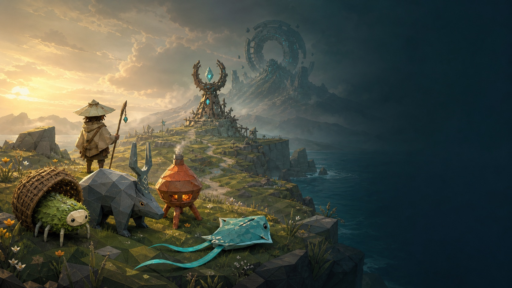

# Wildkin Frontier



Wildkin Frontier is an original, single-player 3D creature-survival and camp-automation game built for the browser. A complete run takes roughly 8–12 minutes: begin with empty hands, gather supplies, craft fantasy launchers, befriend Wildkin with a braided-light tether, build a working camp, collect worker deliveries, raise an inherited baby, forge the Steel Repeater, defeat the Stormhollow guardian, and restore the Wayfarer Beacon. Victory opens continued sandbox play.

This is an independent genre experiment. Its creatures, silhouettes, terminology, world, capture method, structures, progression, recipes, UI, art, audio, balance values, and code are original. It does not contain assets or content copied from any commercial game and is not affiliated with or endorsed by any game publisher.

## Quick start

Requirements: a current Node.js release and npm.

```bash
npm install
npm run dev
```

Open the URL Vite prints, normally `http://localhost:5173/wildkin.html`.

For a production build:

```bash
npm run build
npm run preview
```

The optimized site is written to `dist/`.

## The playable arc

| Approximate time | Milestone |
| --- | --- |
| 0–2 minutes | Gather Sunbark, Cloudstone, Twistgrass, and Sunfruit; craft the Wooden Springcaster and Glimmerline. |
| 2–4 minutes | Weaken and bond a Wildkin; place the Hearthbench, Field Cache, trough, and Sunpatch. |
| 4–6 minutes | Assign a worker, watch its complete travel/work/feed/deposit loop, and manually collect the cache. |
| 5–8 minutes | Bond a compatible second adult, build the Nestbloom, and begin a 45–75 second nursery cycle. |
| 7–10 minutes | Mine Star-iron, craft the Stonebolt Launcher, build the forge, refine Bloomsteel, and welcome an inherited baby. |
| 9–12 minutes | Craft the hold-to-fire Steel Repeater, defeat Stormhollow, restore the beacon, and continue in sandbox mode. |

The nursery and worker timers continue while the player explores, so progress overlaps instead of becoming idle waiting.

## Controls

| Input | Action |
| --- | --- |
| `W` `A` `S` `D` | Move |
| Mouse drag | Look around |
| Left click | Attack, gather, or place a selected structure |
| Hold left click | Repeat-fire the Steel Repeater |
| `Space` | Jump |
| `Shift` | Sprint |
| `Ctrl` | Dodge |
| `E` | Interact, collect, feed, or use |
| `C` | Hold the Glimmerline on a weakened Wildkin |
| `B` | Open camp plans |
| `Tab` or `I` | Open crafting, inventory, and the Wildkin ledger |
| `1`–`8` | Select a hotbar slot |
| `R` | Rotate a structure ghost |
| `Esc` | Cancel placement or pause |

The first-launch field note and pause/settings screens repeat the controls. Settings include master volume, look sensitivity, render scale, and reduced motion.

## How it was made

### 1. Research and originality boundary

The design began with first-party documentation describing broad survival-crafting systems: gathering, creature companionship, worker suitability, base automation, breeding inheritance, and progression tuning. Those sources informed the shape of the loop, not the expression. Before implementation, the project established an explicit boundary against importing names, characters, silhouettes, capture props, maps, UI layouts, recipes, balance data, text, audio, or assets. The reviewed links and the resulting design decisions are recorded in [RESEARCH.md](RESEARCH.md).

### 2. Testable game rules first

`src/wildkin-core.js` contains renderer-independent rules for inventories, recipes, unlock gates, capture odds, worker state machines, breeding, inheritance, growth, quest progress, and versioned save validation. These functions are deterministic and avoid mutating their inputs, which made it possible to test the entire empty-hands-to-victory progression without depending on frame timing or WebGL.

The worker system is a visible state machine rather than a passive number generator. A worker travels to its matching station, performs a timed job, carries a rendered supply bundle to storage, deposits it, seeks the feeder when hungry, eats, and resumes work. Deposits remain in the Field Cache until the player collects them.

### 3. Procedural 3D world and creatures

Three.js renders a compact low-poly island with three readable regions: the warm Sunmeadow, mineral-rich Flintwash, and windy Stormscar. Geometry, materials, structures, five ordinary Wildkin species, the Stormhollow guardian, projectiles, particles, the Glimmerline, the beacon transformation, lighting, fog, water, and landmarks are assembled in code rather than downloaded as models.

Every Wildkin has a distinct body plan and matching work role. Burramble is a wicker-seed hexapod suited to ranching; Flintusk is a slate-plated miner; Coaloon is a bellows-like forge helper; Wickerwing gathers timber; and Rippletail transports supplies. Their attacks, movement accents, material sounds, temperaments, stats, colors, and aptitudes differ.

### 4. Coupled progression rather than isolated features

The recipe and quest gates force every major system to support the next one. Capturing unlocks worker facilities; collecting a real worker delivery unlocks the nursery; a completed nursery cycle and Stonebolt Launcher unlock the final forge path; the Steel Repeater and a born baby wake the guardian; the guardian releases the chime-core needed to activate the beacon. The deterministic golden-path test verifies that the weapon tiers cannot be skipped.

Breeding accepts compatible female/male adults plus four Sunfruit. The baby selects a parental species, blends coat color, chooses each stat from one parent with a small seeded variation, and inherits one temperament and work aptitude. It appears at reduced scale and reaches adulthood quickly.

### 5. Generated presentation art

Built-in OpenAI image generation produced three original presentation assets: the 16:9 title illustration, a vertical field-guide plate containing five creature portraits, and a square parchment/tool-mark UI texture. The prompts name only this project's own silhouettes, materials, palette, and composition; no comparison franchise, studio, artist, existing character, or reference image was supplied. Source PNGs and web-optimized JPEG derivatives are both retained. The normalized production prompts are in [assets/wildkin/IMAGEGEN_PROMPTS.md](assets/wildkin/IMAGEGEN_PROMPTS.md), and provenance is summarized in [ATTRIBUTIONS.md](ATTRIBUTIONS.md).

### 6. Code-generated audio and browser UX

`src/wildkin-audio.js` builds autoplay-safe ambience and effects with Web Audio oscillators, filters, envelopes, and short synthesized noise buffers. Gathering materials, crafting tiers, the three weapons, five creature voices, bonding, workers, feeding, nursery hatching, guardian attacks, damage, and victory each use a related wood/stone/ceramic/air material vocabulary. No audio samples or music files are bundled.

The interface uses a field-journal visual language over the 3D scene. It includes an onboarding note, quest rail, party strip, vitals, hotbar, target and capture feedback, recipe shortages, camp placement ghosts, worker cache, nursery timer, inherited-trait ledger, pause/settings/reset flows, and victory statistics. Panels autofocus an enabled control for keyboard use, and click-versus-drag handling prevents camera movement from also firing a weapon.

### 7. Save safety and verification

Progress autosaves to a stable `localStorage` key using a versioned envelope. Continue discovers legacy version-suffixed keys and migrates supported data. Validation rejects malformed inventories, settings, structures, creatures, worker records, breeding sessions, guardian state, and future versions before runtime state is touched. New Game and Reset require confirmation.

The final game was exercised through its normal production page at 1280×720 and 1440×900. Browser QA covered the title, onboarding, immediate keyboard engagement, crafting and build panels, portrait ledger, pause/settings/reset flows, mouse-drag camera control, responsive bounds, legacy-save discovery, and a clean production console.

## Architecture

| Path | Responsibility |
| --- | --- |
| `wildkin.html` | Accessible game shell, title screen, HUD, panels, onboarding, settings, reset, and victory markup |
| `src/wildkin.js` | Runtime orchestration, player controls, entity behavior, combat, placement, UI, persistence, and game loop |
| `src/wildkin-core.js` | Deterministic inventories, crafting, capture, workers, breeding, growth, progression, and save validation |
| `src/wildkin-visuals.js` | Procedural Three.js island, Wildkin, structures, props, effects, guardian, and beacon |
| `src/wildkin-audio.js` | Procedural Web Audio ambience, material effects, creature voices, combat, and victory cues |
| `src/wildkin.css` | Responsive field-journal UI, accessibility states, HUD, panels, and title treatment |
| `tests/wildkin-core.test.mjs` | Focused deterministic system and corrupt-save tests |
| `tests/wildkin-golden-path.test.mjs` | Full empty-inventory progression through saved victory, reload, and reset |

## Verification

```bash
npm run check
npm test
npm run build
```

`npm run check` runs ESLint over every runtime/test module and JavaScript typechecking over the deterministic rules and tests. The test suite covers zero-inventory start, recipe/station gates, immutable crafting, capture reliability, worker travel/feeding/deposits, manual collection, compatible breeding, inherited traits, timed growth, all three weapon tiers, guardian/beacon victory, save migration, corrupt-save rejection, reload, and reset.

## Scope

- Desktop keyboard and mouse are the supported inputs; touch controls and networking are outside this vertical slice.
- The economy and island are deliberately compact for one complete sitting, not a long-form survival campaign.
- Three.js is bundled with the game, so Vite may print its standard advisory for a JavaScript chunk larger than 500 kB.

## Original `/goal` prompt — video archive

This is the complete build prompt supplied to the `/goal` run that produced the repository. It is preserved here verbatim so the original brief, constraints, and definition of done are available for studio and video use.

<details>
<summary>Show the complete original goal prompt</summary>

```text
Build and verify “Wildkin Frontier,” a polished original single-player 3D browser game blending creature-survival automation, voxel gathering/building, and cozy life-sim beats. Ship an 8–12 minute vertical slice from empty inventory through survival, crafting, capture, automation, breeding, final upgrade, and victory, followed by sandbox play. Do not stop at a plan, mockup, or tech demo.

Inspect the repo, AGENTS.md, and tools. Briefly research official Palworld gameplay sources only for high-level genre systems; record source links. Make all expression original: title, creatures, silhouettes, names, lore, UI, recipes, structures, capture method, world, art, audio, and code. Do not copy or closely imitate Palworld/Pokémon/Minecraft/ARK assets, characters, maps, logos, terms, UI, text, sounds, or data; never rip/download their assets.

Preserve a viable stack. If blank, use Vite + TypeScript + Three.js with documented one-command run/build. Prefer procedural low-poly geometry, animation, particles, lighting/fog, compact terrain, and Web Audio. Favor polish and stability over breadth.

GAME: Create a compact island with 3 readable areas, landmarks, resources, hazards, and an original guardian. Support mouse-look movement, jump/sprint, gathering wood/stone/fiber/food/ore, health/stamina/hunger, recipe crafting, place/rotate structures, combat/dodge, and forgiving respawn. Progress through original fantasy weapons: Wooden Springcaster → Stonebolt Launcher → Steel Repeater, gated by gathering, workbench, smelting, and steel.

Create 4+ original 3D species with distinct silhouettes, attacks, stats, temperaments, and work skills. Players weaken and capture them with a visible original tether/snare; captures follow/fight or work at base. Include workbench, storage bin, feeder, nursery, farm, and forge. Workers visibly do suitable jobs, eat, deposit resources, and require player collection. Breeding uses two compatible adults plus food, produces a smaller baby in 45–75 seconds, mixes parental color/stat/work traits, and matures quickly.

PACE: An optional quest chain teaches without blocking. Tune a blind run for capture by ~3 minutes, worker output by ~5, baby by ~7–9, then Steel Repeater plus guardian/beacon victory near minute 10. Avoid grind, soft locks, and idle waiting.

ART: Read/follow the imagegen skill. Use built-in image generation for original title art and a small cohesive portrait/UI/texture set; prompts must not name/mimic franchises. Integrate and web-optimize output. Use only created/generated or clearly permissive assets and document provenance; keep gameplay readable in 3D.

UX: WASD move; mouse look; Space jump; Shift sprint; E interact/collect; left-click attack; C tether; B build; Tab inventory/crafting; 1–8 hotbar; Esc pause. Show controls on first launch and pause. Include crosshair, quests, vitals, hotbar, prompts, recipe needs, capture feedback, worker/breeding status, victory, and volume. Every button works; layouts are readable at 1280×720 and 1440×900.

SAVE: Autosave versioned state to localStorage. Continue/New Game/confirmed Reset work. Reload preserves inventory, structures, creatures, assignments, progress, and settings; corrupt saves fail safely.

DONE: Add a concise README. Add deterministic systems tests and browser smoke/e2e or a debug-only harness proving: zero-inventory start; gather/craft/place; capture/deploy; worker deposit/collection; inherited baby; all weapons; combat/victory; save/reload/reset. Run build, tests, lint/typecheck. Launch/play the normal game, inspect console errors, and visually QA both sizes; fix clipping, contrast, camera, controls, performance, and gameplay. No exposed cheats, post-setup network dependency, broken controls, major TODOs, or fake buttons. Work autonomously, make reasonable assumptions, and parallelize only non-overlapping work. Finish only when the golden path passes; report features, commands/results, generated assets, limitations, and how to play.
```

</details>
